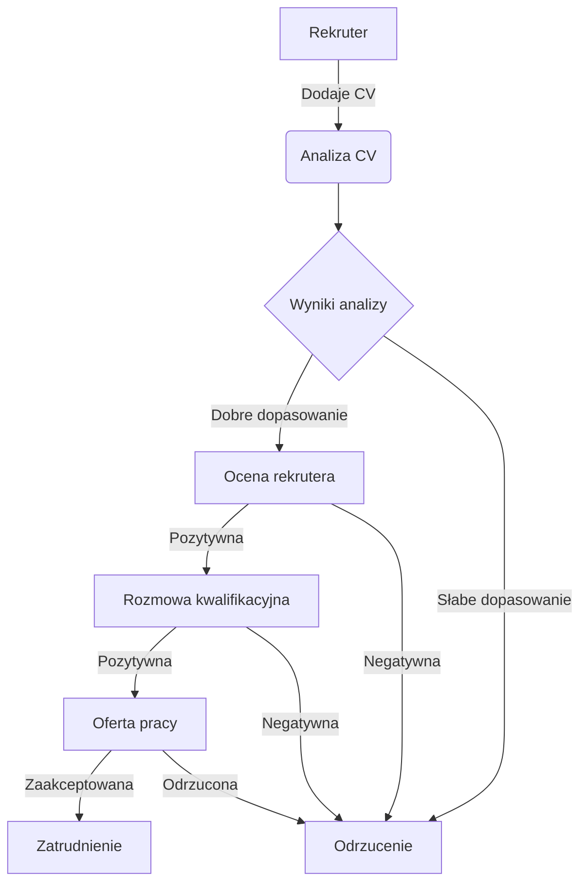
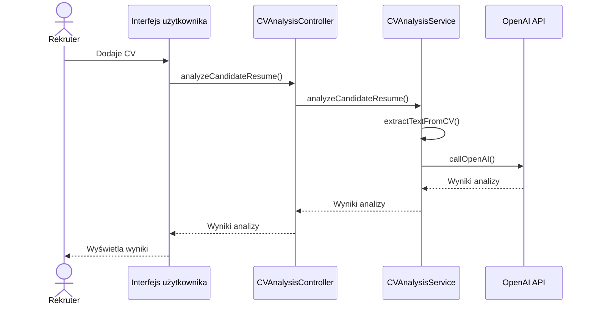
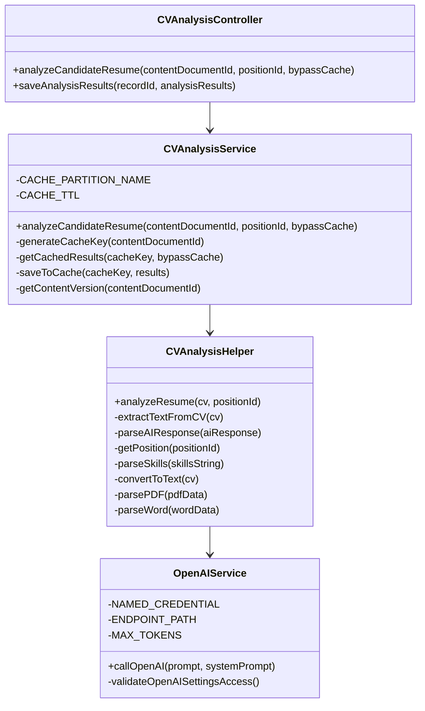
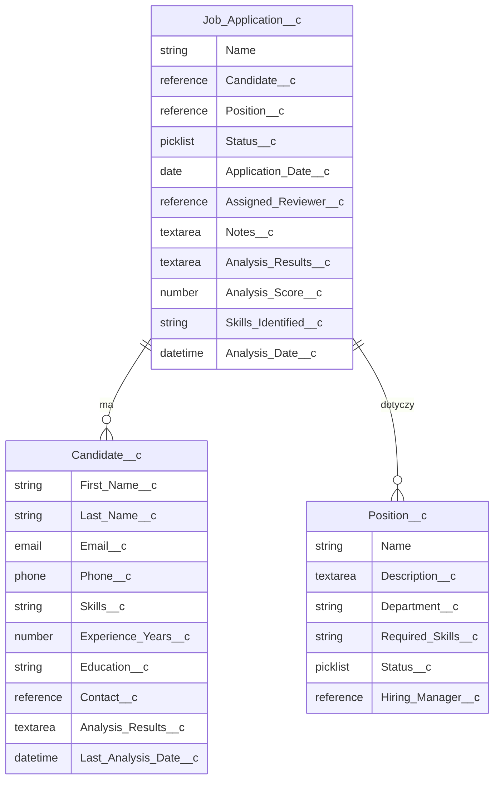
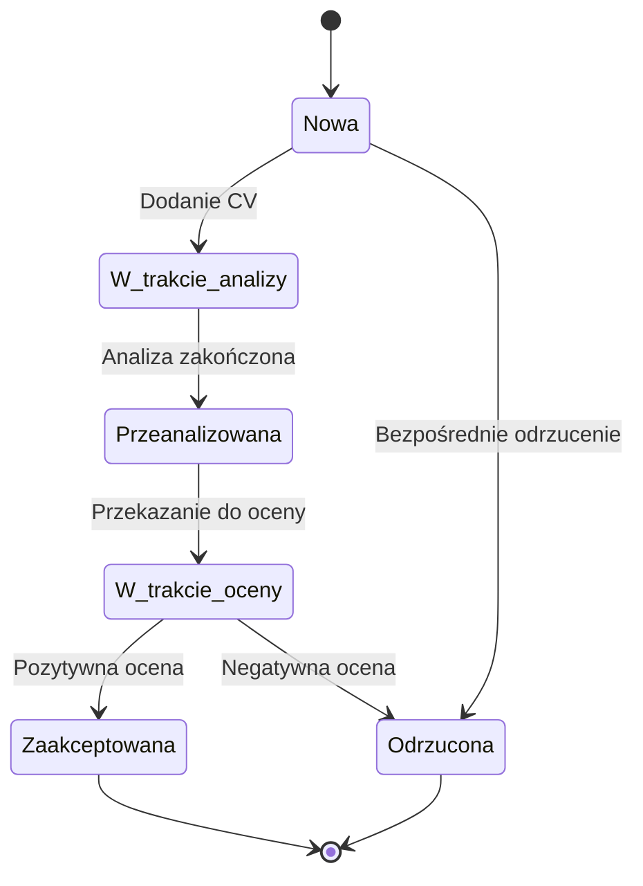
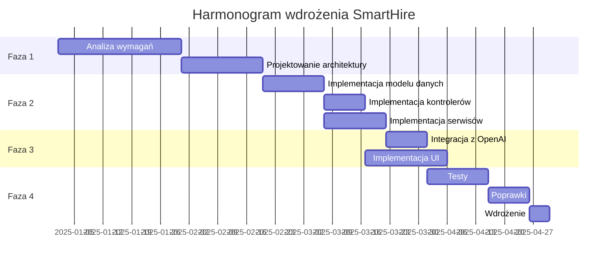
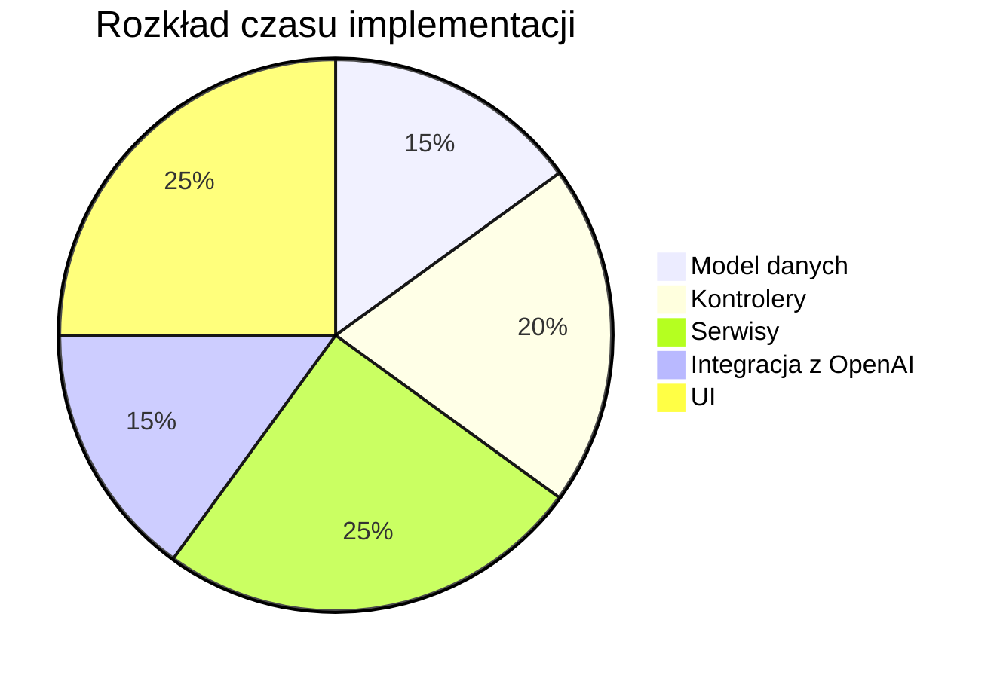
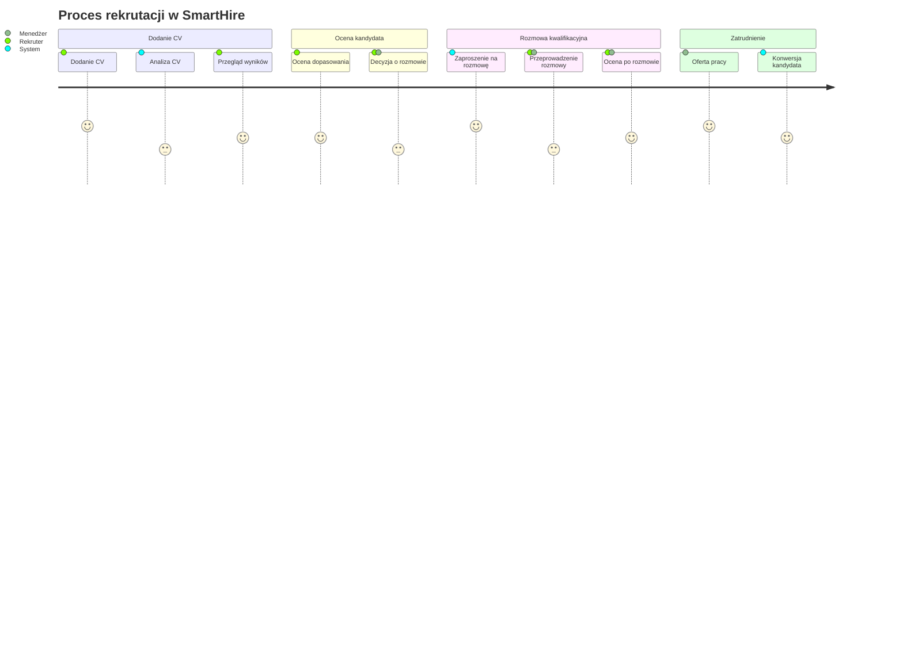

# SmartHire - Przykłady diagramów Mermaid

Ten plik zawiera przykłady kodu Mermaid do generowania różnych diagramów dla projektu SmartHire.

## 1. Diagram przepływu pracy (Flowchart)

## 2. Diagram sekwencji (Sequence Diagram)

## 3. Diagram klas (Class Diagram)

## 4. Diagram encji (Entity Relationship Diagram)

## 5. Diagram stanów (State Diagram)

## 6. Diagram Gantta (Gantt Chart)

## 7. Diagram pie (Pie Chart)

## 8. Diagram użytkownika (User Journey)

## Jak używać tych diagramów

1. Skopiuj kod diagramu, który chcesz użyć
2. Wklej go do pliku Markdown w swoim repozytorium
3. Dostosuj diagram do swoich potrzeb
4. Renderuj plik Markdown w środowisku, które obsługuje Mermaid (np. GitHub, GitLab, VS Code z odpowiednim rozszerzeniem)

## Dodatkowe zasoby

- [Oficjalna dokumentacja Mermaid](https://mermaid-js.github.io/mermaid/#/)
- [Edytor online Mermaid Live Editor](https://mermaid-js.github.io/mermaid-live-editor/)
- [Rozszerzenie VS Code dla Mermaid](https://marketplace.visualstudio.com/items?itemName=bierner.markdown-mermaid)